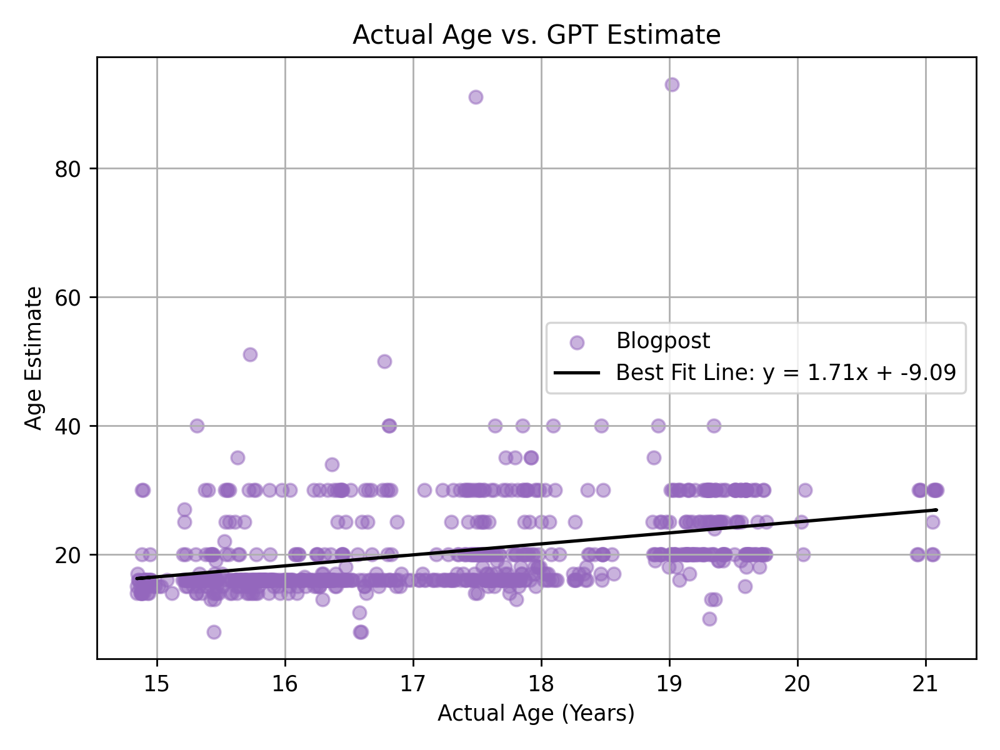

# Blog Analysis with ChatGPT

## Introduction

This program analyzes a set of around 800 blog posts, mostly about my 
personal life, that I wrote between the ages of 15 and 21. It uses
`BeautifulSoup` to parse the HTML files that constitute the blog archive
and extract each post's title, date, and body. Various features of interest 
about each blog post are calculated. For some features, ChatGPT is called 
via the `OpenAI` API, and its responses are cached in a `sqlite3` database
to avoid unnecessary API calls when re-running the program.
The program uses `Matplotlib` and `NumPy` to create graphs that show how
certain numerical features change over time. One question I had was: based
on each blog post's text, how accurately can ChatGPT estimate my age?

## Usage Examples

Loading the dataset and calculating features:
```python
dataset = get_blogpost_dataset("data/XangaBlogPosts")
dataset_with_features = add_features_to_dataset(dataset)
```
Previewing the post title, beginning of post body, and features:
```python
preview_features(dataset_with_features[:10]  # just the first ten posts)
```
Which prints output like this (per post):
```
Title: Which Language to Learn Next? | Date: 2012-02-07
Content: After seven years of study, my level of French seems to have reached a point of ...
Features:
  word_count: 743
  day_of_week: Tuesday
  age_of_emily: 21.078713210130047
  topic: Choosing between German and Spanish
  age_estimate: 30.0
```
For a fun trip down memory lane, I also wanted a quick and easy way to look at just the topic
summaries ChatGPT generated for all my posts:
```python
show_summaries(dataset_with_features[:10])  # just the first ten posts)
```
Which prints output like this:
```
Choosing between German and Spanish
First Christmas away from family.
Highlights of trip: living with cats
Visiting Pretoria and its attractions.
Professor uses powerful songs, poems.
Parents and others demand smiles
Pet peeves on self-referential posts.
Regret ending online friendship, loneliness
Challenging senior year with rigorous courses
Anxiety-induced sleep troubles and volunteering.
Unhappy with P.E. teacher, election excitement, terrified of squirrels
Dream of exploring Chinese city.
Physics project success, English class discomfort, unexpected reunion
Key Club election results and socializing
WYSE competition and school fundraiser.
Photos from colorful park outing.
```

## Data Visualization

This scatterplot of Chat GPT's age estimate plotted against my actual age shows (thankfully!) a positive correlation between the two variables, with a few outliers:

The program could still be expanded to see whether my age at the time of writing correlates better with more traditional predictors like word count or difficulty, sentence length, or other measures of writing complexity.